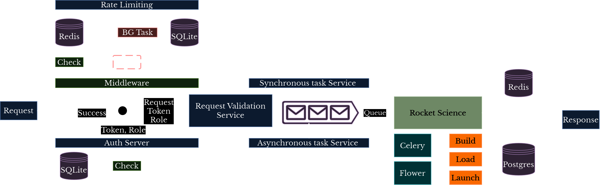

    

# <primary> FastAPI, Celery with RabbitMQ, Redis for Rocket Science </primary>
## A Learning project for FastAPI(REST), Cashing(Redis), DB(Postgres), ORM(SQLAlchemy), Celery(Task manager), RabbitMQ(Message Queue), Flower(Task Monitoring) Docker(Containerization), Kubernetes(Orchestration) and Rocket Science.
It's a simple open-source learning project. It features a good story of ordering, building, fueling, launching rockets. Underneath the great story the following features will be covered.

### Features
- [ ] <todo>Versioning</todo>
- [ ] <todo>Routing</todo>
- [ ] <todo> Request</todo>
  - [ ] <todo> Query Parameter </todo>
  - [ ] <todo> Path Parameter </todo>
  - [ ] <todo> Body Parameter </todo>
  - [ ] <todo> Request Header </todo>
  - [ ] <todo> Validation </todo>
- [ ] <todo> HTTP Methods </todo>
  - [ ] <todo> GET </todo>
  - [ ] <todo> POST </todo>
  - [ ] <todo> DELETE </todo>
  - [ ] <todo> PUT </todo>
  - [ ] <todo> PATCH </todo>
- [ ] <todo> Response </todo>
  - [ ] <todo> JSON Response </todo>
  - [ ] <todo> Template Response </todo>
  - [ ] <todo> Background Task </todo>
- [ ] <todo> Authentication </todo>
  - [ ] <todo> API Key </todo>
  - [ ] <todo> OAuth </todo>
  - [ ] <todo> JWT </todo>
- [ ] <todo> Authorization </todo>
  - [ ] <todo> Roles </todo>
  - [ ] <todo> Actions </todo>
- [ ] <todo> Rate Limiting </todo>
  - [ ] <todo> IP Babesed </todo>
  - [ ] <todo> User Specific </todo>
- [ ] <todo> Middleware </todo>
  - [ ] <todo> CORS </todo>
  - [ ] <todo> Tracing </todo>
- [ ] <todo> Async </todo>
  - [ ] <todo> Background Task </todo>
  - [ ] <todo> Celery </todo>
- [ ] <todo> Documentation </todo>
  - [ ] <todo> Customization </todo>
- [ ] <todo> Testing </todo>
  - [ ] <todo> Auto testing </todo>
  - [ ] <todo> Manual Testing </todo>
  - [ ] <todo> Load Testing </todo>
- [ ] <todo> Error Handling </todo>
  - [ ] <todo> Traceable Error </todo>
  - [ ] <todo> Non-Traceable Error </todo>
  - [ ] <todo> Custom Error </todo>
- [ ] <todo> Pagination </todo>
- [ ] <todo> Cashing </todo>
  - [ ] <todo> Request </todo>
  - [ ] <todo> Response </todo>
- [ ] <todo> Web Hook </todo>
- [ ] <todo> Logging </todo>
- [ ] <todo> CI-CD </todo>
- [ ] <todo> Circuit Braker </todo>
- [ ] <todo> Retry Mechanism </todo>