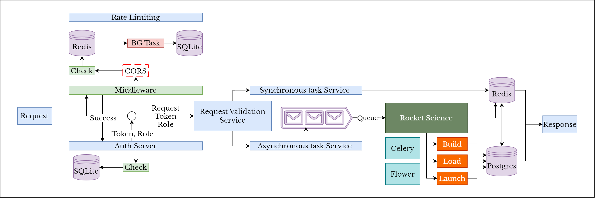

# <primary> FastAPI, Celery with RabbitMQ, Redis for Rocket Science </primary>
### A Learning project for FastAPI(REST), Cashing(Redis), DB(Postgres), ORM(SQLAlchemy), Celery(Task manager), RabbitMQ(Message Queue), Flower(Task Monitoring) Docker(Containerization), Kubernetes(Orchestration) and Rocket Science.
It's a simple open-source learning project. It features a good story of ordering, building, fueling, launching rockets. Underneath the great story the following features will be covered.

### Features
- [*] Versioning
  - [*] With Library
  - [*] With custom
- [*] Routing
- [ ]  Request
  - [*]  Path Operation
  - [ ]  Path Config [tag]
  - [*]  Query Parameter 
  - [*]  Path Parameter 
  - [*]  Body Parameter 
  - [ ]  Request Header 
  - [ ]  Validation 
- [ ]  HTTP Methods 
  - [ ]  GET 
  - [ ]  POST 
  - [ ]  DELETE 
  - [ ]  PUT 
  - [ ]  PATCH 
- [ ]  Response 
  - [ ]  JSON Response 
  - [ ]  Template Response 
  - [ ]  Background Task 
- [ ]  Authentication 
  - [ ]  API Key 
  - [ ]  OAuth 
  - [ ]  JWT 
- [ ]  Authorization 
  - [ ]  Roles 
  - [ ]  Actions 
- [ ]  Rate Limiting 
  - [ ]  IP Babesed 
  - [ ]  User Specific 
- [ ]  Middleware 
  - [ ]  CORS 
  - [ ]  Tracing 
- [ ]  Async 
  - [ ]  Background Task 
  - [ ]  Celery 
- [ ]  Documentation 
  - [ ]  Customization 
- [ ]  Testing 
  - [ ]  Auto testing 
  - [ ]  Manual Testing 
  - [ ]  Load Testing 
- [ ]  Error Handling 
  - [ ]  Traceable Error 
  - [ ]  Non-Traceable Error 
  - [ ]  Custom Error 
- [ ]  Pagination 
- [ ]  Cashing 
  - [ ]  Request 
  - [ ]  Response 
- [ ]  Web Hook 
- [ ]  Logging 
- [ ]  CI-CD 
- [ ]  Circuit Braker 
- [ ]  Retry Mechanism 